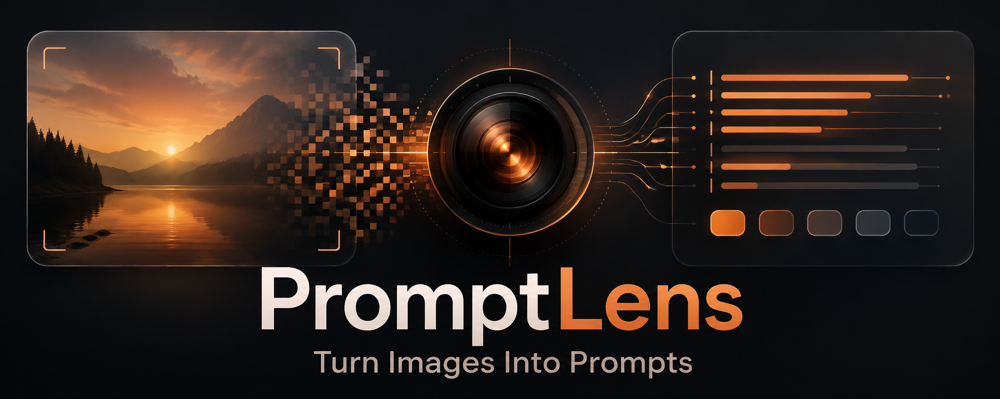
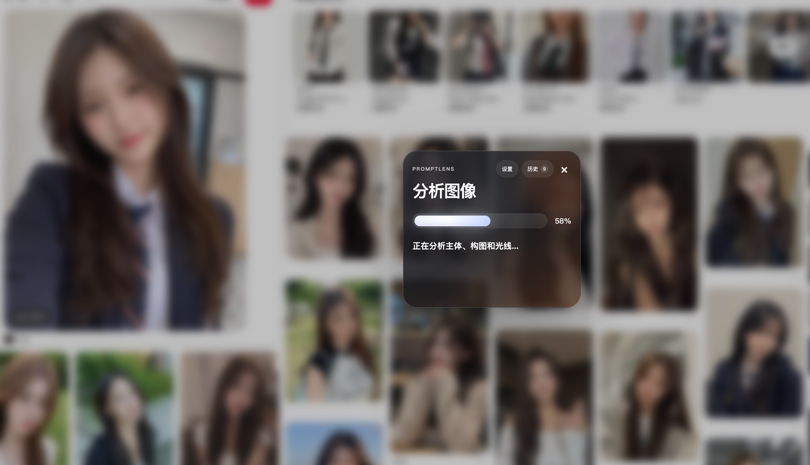
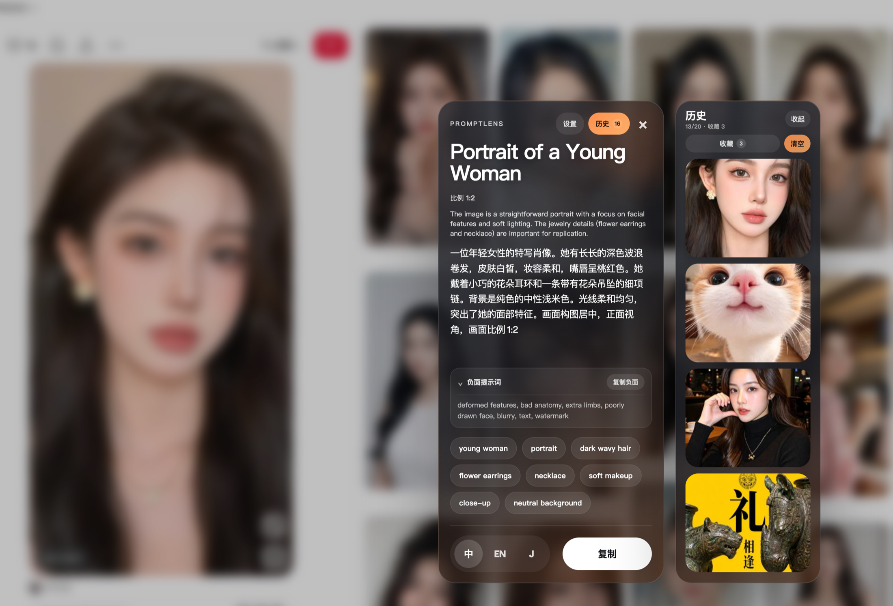
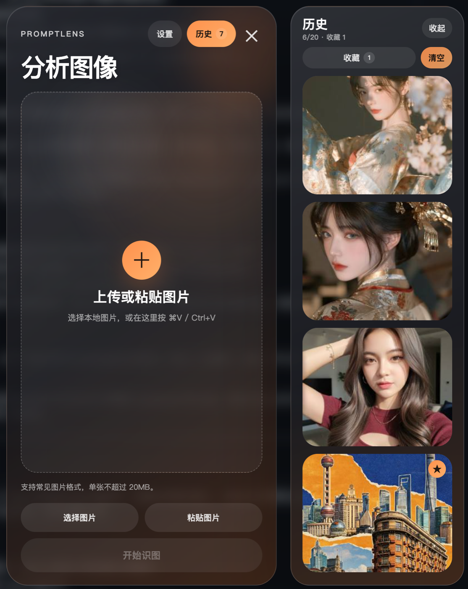
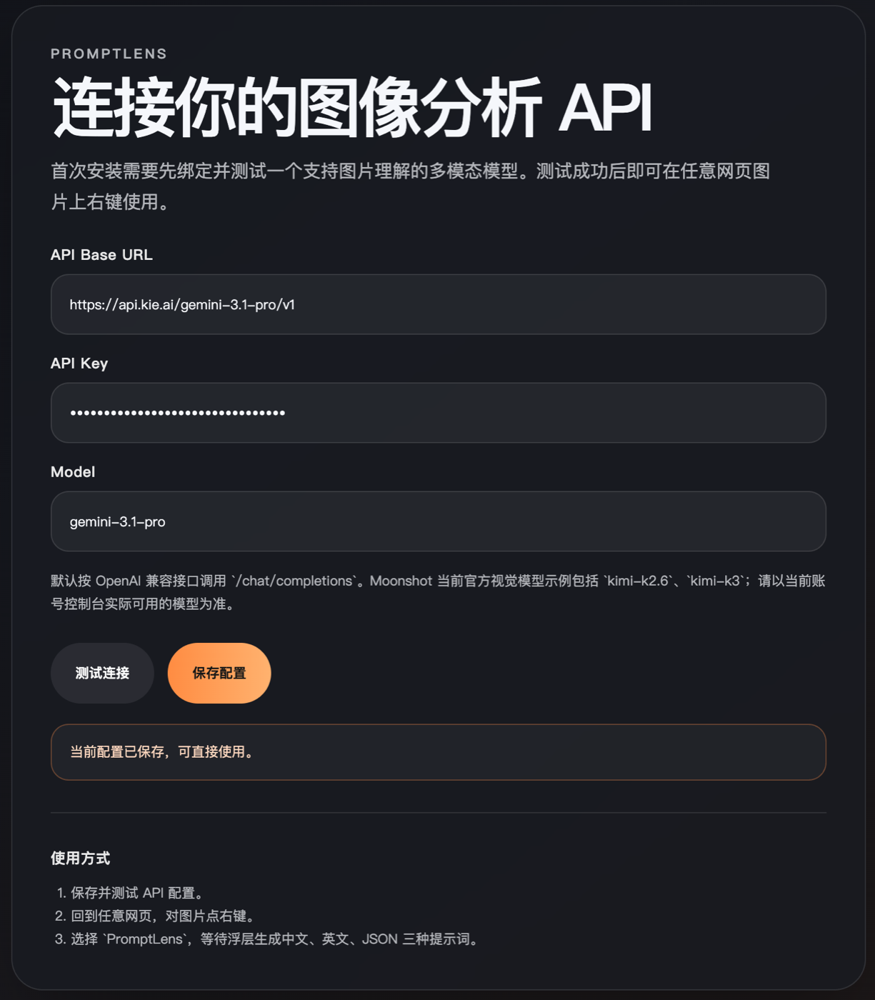

  

  
  
  

## 中文

PromptLens 是一款 Chrome / Edge 图片反向提示词扩展。它可以分析网页图片、本地图片或剪贴板截图，生成可编辑的中文、英文和 JSON 生图提示词。

### 功能

- 右键分析网页图片，或点击扩展图标上传、粘贴本地图片
- 输出中文、英文和结构化 JSON 提示词
- 针对当前图片生成负面提示词，支持折叠查看与单独复制
- 场景自适应分析人物、产品、建筑、风景、插画、3D、海报、UI 等图片
- 自动提取画面比例、主体、构图、光线、色彩、材质与风格
- 本地历史记录、单条删除、清空和收藏保护
- 支持多数采用 `/chat/completions` 与 `image_url` 的 OpenAI 兼容视觉模型

  

右键选择 PromptLens 后，以紧凑窗口分析图片。 · Right-click PromptLens to analyze an image in a compact window.

  

识别完成后，生成可直接用于生图的专业提示词。 · Get professional, generation-ready prompts when analysis finishes.

  

点击插件时，弹出上传或粘贴图片窗口。 · Click the extension icon to upload or paste an image.

### 我正在使用的 API（友情推荐）

我自己使用的是 [Kie AI](https://kie.ai?ref=c901b57c3461c56c8bb112b98a9c81c4) 的聚合型 API，一个 API Key 可以使用平台上的众多热门模型。目前我搭配 PromptLens 使用的是 `gemini-3.1-pro`，成本非常低：按我目前的实际使用情况，单张图片通常不到 **US$0.01**。实际费用会随图片、提示词长度和平台定价变化，请以 Kie AI 的实时账单为准。**有兴趣的可以尝试，友情推荐，自行判断！**

PromptLens 配置格式：

- **API Base URL：** `https://api.kie.ai/gemini-3.1-pro/v1`
- **API Key：** 你自己的 API Key
- **Model：** `gemini-3.1-pro`

了解更多：[Kie AI](https://kie.ai?ref=c901b57c3461c56c8bb112b98a9c81c4)

> 上述链接包含推荐参数，可能用于推广统计。请自行评估服务质量、价格和隐私政策。

  

Kie AI 配置示例 · Kie AI configuration example

### 下载

前往 [Releases](https://github.com/binghe1980/PromptLens/releases/latest) 下载 `PromptLens-v1.1.0.zip`，然后解压。也可以使用[直接下载链接](https://github.com/binghe1980/PromptLens/releases/latest/download/PromptLens-v1.1.0.zip)。

版本规划：当前功能版本为 `1.1.0`；`1.1.x` 用于兼容修复，下一项向后兼容的新功能使用 `1.2.0`，不兼容变更才升级到 `2.0.0`。

### Chrome 安装

1. 在地址栏打开 `chrome://extensions`。
2. 打开右上角的“开发者模式”。
3. 点击“加载已解压的扩展程序”。
4. 选择刚才解压得到的 `PromptLens` 文件夹。

### Edge 安装

1. 在地址栏打开 `edge://extensions`。
2. 打开左侧的“开发人员模式”。
3. 点击“加载解压缩的扩展”。
4. 选择刚才解压得到的 `PromptLens` 文件夹。

### 首次使用

1. 点击浏览器工具栏中的 PromptLens 图标，再点击“设置”。
2. 填写你的 API Base URL、API Key 和支持图片理解的模型名称。
3. 点击“测试连接”，成功后保存配置。
4. 在网页图片上右键选择 PromptLens，或点击扩展图标上传/粘贴图片。

> PromptLens 不提供 API 额度。图片分析费用由你选择的 API 平台按照其规则收取。

### 识图模型建议

- **质量优先：** 推荐使用支持视觉理解的最新 Pro 级多模态模型，例如 Gemini 3.1 Pro，更适合提取细节丰富、可直接用于生图的提示词。
- **速度与成本优先：** 可以选择 Flash 级视觉模型，通常响应更快、费用更低，但复杂人物、材质和风格细节可能略少。
- **兼容性：** 模型需要支持图片输入，以及 OpenAI 兼容的 `/chat/completions` 与 `image_url` 格式。不同平台的模型名称和权限可能不同，请先在设置中测试连接。

### 隐私与数据

- API Key 保存在当前浏览器配置的本地扩展存储中，不会上传给 PromptLens 作者。
- 图片与提示词会直接发送到你自行配置的 API 地址，请阅读对应平台的隐私条款。
- PromptLens 不包含统计分析、广告 SDK 或作者自建中转服务器。
- 删除历史记录时，对应的本地缩略图会一起从扩展存储中删除；普通清空会保留收藏，收藏页可单独清空收藏。

### 授权说明

PromptLens 不是开源软件。允许下载并使用未经修改的正式版本；禁止二次商用、出售、再分发、修改或衍生开发。完整条款见 [LICENSE](LICENSE)。

浏览器的“加载已解压扩展”机制要求发布包包含运行所需的 JavaScript 和 CSS，因此无法从技术上阻止查看这些文件；这不代表获得修改、复制或再分发授权。

---

## English

PromptLens is a Chrome / Edge reverse-prompt extension. It analyzes webpage images, local files, or clipboard screenshots and produces editable Chinese, English, and structured JSON prompts for image generation.

### Features

- Analyze a webpage image from the context menu, or upload/paste a local image from the toolbar
- Generate Chinese, English, and structured JSON prompts
- Generate image-specific negative prompts with collapsible display and separate copying
- Scene-adaptive analysis for portraits, products, architecture, landscapes, illustration, 3D, posters, UI, and mixed images
- Extract aspect ratio, subject, composition, lighting, colors, materials, and visual style
- Local history with individual deletion, clear-all, and protected favorites
- Works with most OpenAI-compatible vision models that support `/chat/completions` and `image_url`

### Download

Open [Releases](https://github.com/binghe1980/PromptLens/releases/latest), download `PromptLens-v1.1.0.zip`, and unzip it. A [direct download link](https://github.com/binghe1980/PromptLens/releases/latest/download/PromptLens-v1.1.0.zip) is also available.

Version plan: the current feature release is `1.1.0`; `1.1.x` is reserved for compatible fixes, the next backward-compatible feature release will be `1.2.0`, and breaking changes will use `2.0.0`.

### Install on Chrome

1. Open `chrome://extensions`.
2. Enable **Developer mode** in the upper-right corner.
3. Click **Load unpacked**.
4. Select the extracted `PromptLens` folder.

### Install on Edge

1. Open `edge://extensions`.
2. Enable **Developer mode** in the sidebar.
3. Click **Load unpacked**.
4. Select the extracted `PromptLens` folder.

### First-time setup

1. Click the PromptLens toolbar icon, then open **Settings**.
2. Enter your API Base URL, API Key, and a vision-capable model name.
3. Test the connection and save the configuration.
4. Right-click a webpage image and choose PromptLens, or use the toolbar to upload/paste an image.

> PromptLens does not include API credits. Your chosen API provider may charge for image analysis.

### Choosing a vision model

- **Best quality:** Use a recent Pro-class multimodal model with vision support, such as Gemini 3.1 Pro, for detailed prompts that are ready for image generation.
- **Lower cost and faster responses:** A Flash-class vision model is usually faster and less expensive, but may capture fewer details in complex portraits, materials, and visual styles.
- **Compatibility:** The model must accept image input through OpenAI-compatible `/chat/completions` and `image_url`. Model names and account permissions vary by provider, so test the connection in PromptLens first.

### The API I use (personal recommendation)

I use the [Kie AI](https://kie.ai?ref=c901b57c3461c56c8bb112b98a9c81c4) aggregated API, which provides access to many popular models with one API key. My current PromptLens model is `gemini-3.1-pro`. Based on my own recent usage, analyzing one image usually costs less than **US$0.01**. Actual cost depends on the image, prompt length, and current platform pricing. **Feel free to try it, but evaluate it for yourself.**

PromptLens configuration:

- **API Base URL:** `https://api.kie.ai/gemini-3.1-pro/v1`
- **API Key:** Your own API key
- **Model:** `gemini-3.1-pro`

Learn more: [Kie AI](https://kie.ai?ref=c901b57c3461c56c8bb112b98a9c81c4)

> The link above contains a referral parameter that may be used for promotional attribution. Please evaluate the service, pricing, and privacy policy independently.

### Privacy and data

- Your API Key is stored in the extension's local browser storage and is not uploaded to the PromptLens author.
- Images and prompts are sent directly to the API endpoint you configure. Review that provider's privacy policy.
- PromptLens contains no analytics, advertising SDK, or author-operated relay server.
- Deleting a history entry also removes its local thumbnail. Normal clear-all preserves favorites; favorites can be cleared separately.

### License

PromptLens is not open-source software. You may download and use an unmodified official release. Commercial redistribution, resale, modification, and derivative development are prohibited. See [LICENSE](LICENSE) for the complete terms.

Unpacked browser extensions necessarily contain readable JavaScript and CSS files. Their visibility does not grant permission to modify, copy, or redistribute them.
